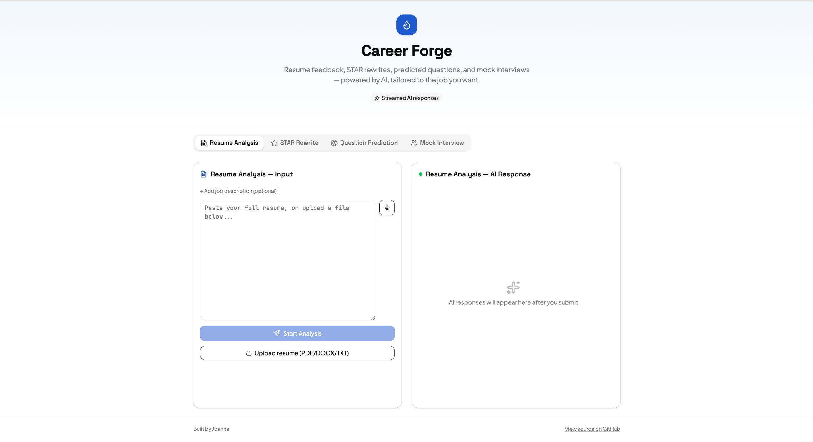

# Career Forge


AI-powered interview prep: paste a resume and a target role, get instant
strengths/weaknesses feedback, STAR-formatted talking points, predicted
interview questions, and a live mock interview — all in one app, with
responses streamed in real time and optionally tailored to a specific
job description.

**Live demo:** [career-forge-ochre.vercel.app](https://career-forge-ochre.vercel.app/)

<!-- Add a screenshot or short GIF here once you have one, e.g.: -->
<!--  -->

## Table of contents

- [Features](#features)
- [Tech stack](#tech-stack)
- [How it's built](#how-its-built)
- [Quick start](#quick-start)
- [Configuration](#configuration)
- [Project structure](#project-structure)
- [License](#license)

## Features

- **Resume Analysis** — strengths, weaknesses, a role-fit score, and key areas to prepare
- **STAR Rewrite** — turns a work story into Situation / Task / Action / Result format
- **Question Prediction** — 5 likely interview questions for a target role, by category
- **Mock Interview** — a multi-turn simulated interviewer that follows up on your answers, with
  an on-demand scorecard (overall rating, communication, technical depth, STAR usage, and
  improvement areas) once you're done
- **Job-description matching** — optionally paste a target job description and every tool
  tailors its output to that specific posting instead of giving generic advice
- Streamed, token-by-token AI responses (no waiting on a full reply)
- Voice input via the browser's Web Speech API
- Markdown-rendered responses, light/dark mode
- Per-IP API rate limiting to protect against abuse

## Tech stack

- [Next.js](https://nextjs.org) (App Router) + React + TypeScript
- [Vercel AI SDK](https://sdk.vercel.ai) (`ai`, `@ai-sdk/react`) for streaming chat, via the
  [OpenRouter provider](https://openrouter.ai) — model is configurable, so it can point at
  any OpenRouter-hosted model
- [Tailwind CSS](https://tailwindcss.com) v4 + [shadcn/ui](https://ui.shadcn.com) components
- [lucide-react](https://lucide.dev) icons

## How it's built

- `app/api/chat/route.ts` streams model output with `streamText` +
  `toUIMessageStreamResponse()` instead of blocking on the full completion, so replies
  render as they're generated
- `app/page.tsx` drives chat state with `useChat` (`@ai-sdk/react`), keeping each of the
  four tools' conversations isolated by mode
- A mode-specific system prompt per tool controls output format (e.g. structured
  Markdown for resume analysis vs. a running Q&A loop for the mock interview)
- An optional job description, when provided, is folded into the system prompt so every
  tool's output is tailored to that specific role
- A simple in-memory per-IP rate limiter in the API route guards against abuse of the
  OpenRouter key on the public demo
- UI built on shadcn/ui primitives with a custom Tailwind theme, rather than one-off styling

## Quick start

```bash
git clone https://github.com/JoannaLei-ljq/career-forge.git
cd career-forge
pnpm install
cp .env.example .env.local   # then add your OpenRouter key, see below
pnpm dev
```

Open [http://localhost:3000](http://localhost:3000).

## Configuration

<details>
<summary>Environment variables</summary>

| Variable             | Description                                                                                        |
| --------------------- | ----------------------------------------------------------------------------------------------------- |
| `OPENROUTER_API_KEY` | API key from [openrouter.ai](https://openrouter.ai/keys)                                              |
| `OPENROUTER_MODEL`   | Model ID to use, e.g. `openai/gpt-4o-mini` (see [openrouter.ai/models](https://openrouter.ai/models)) |

Set these in `.env.local` for local development, or in your hosting provider's
environment variable settings (e.g. Vercel Project Settings) for deployment.

</details>

## Project structure

- `app/page.tsx` — main UI: tool switcher, input panel, streaming response panel
- `app/api/chat/route.ts` — API route that streams a mode-specific system prompt + user
  input through OpenRouter
- `components/ui/` — shadcn primitives (Button, Card, Tabs, Textarea, etc.)

## License

[MIT](./LICENSE) © Joanna

## Author

Joanna
